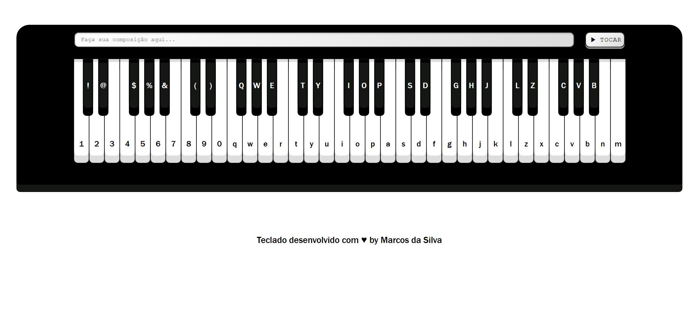

<h1 align="center"> Piano Virtual </h1>

Projeto desenvolvido no curso B7WEB Fullstack para aplicar conhecimentos avançados de JavaScript  

  <a href="#-tecnologias">Tecnologias</a>&nbsp;&nbsp;&nbsp;|&nbsp;&nbsp;&nbsp;
  <a href="#-projeto">Projeto</a>

 

  

## 🚀 Tecnologias

Esse projeto foi desenvolvido com as seguintes tecnologias:

- HTML e CSS
- JavaScript
- Git e Github

## 💻 Projeto

O projeto apresenta um piano virtual com template responsivo, no qual cria dinamicamente utilizando o DOM,  
13 a 61 teclas de acordo com a resolução do dispositivo aonde é aberto.

- [Acesse o projeto finalizado, online](https://albertmagnus011.github.io/pianoVirtual/)

---

Feito com ♥ by Marcos da Silva 